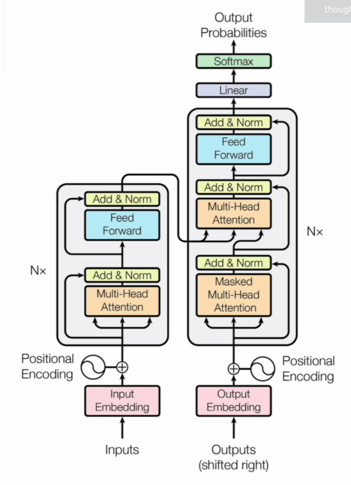
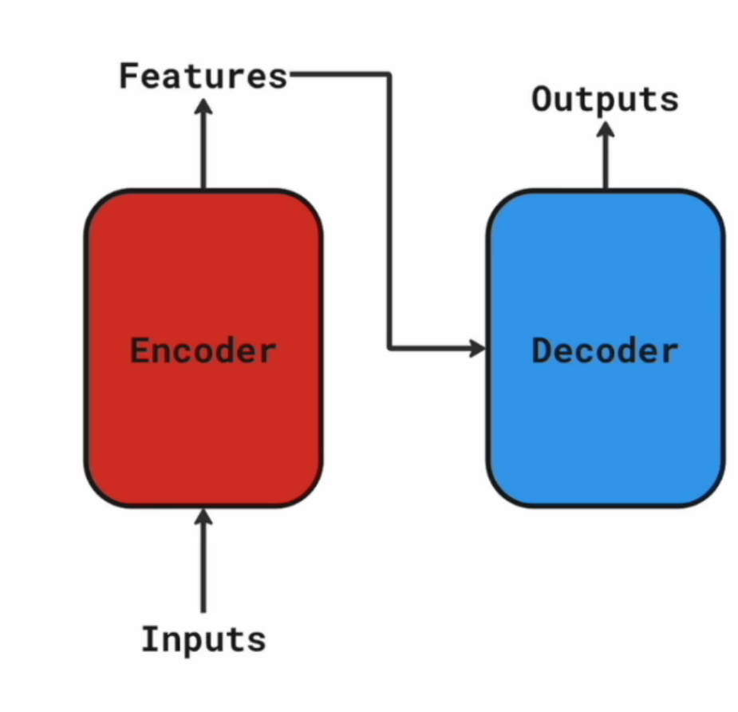
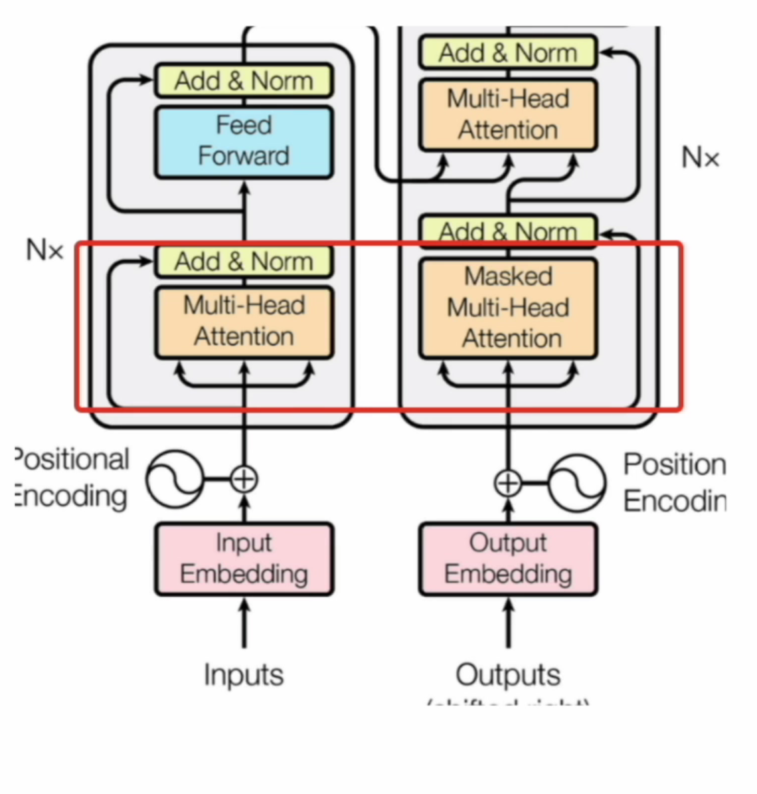
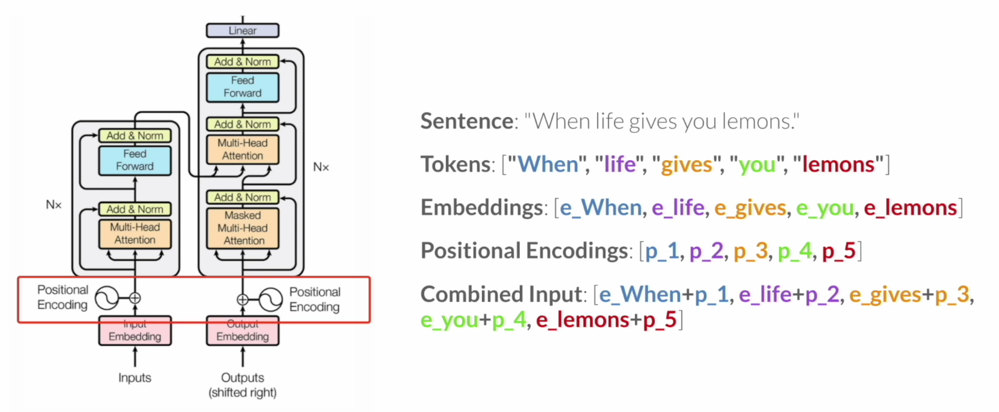
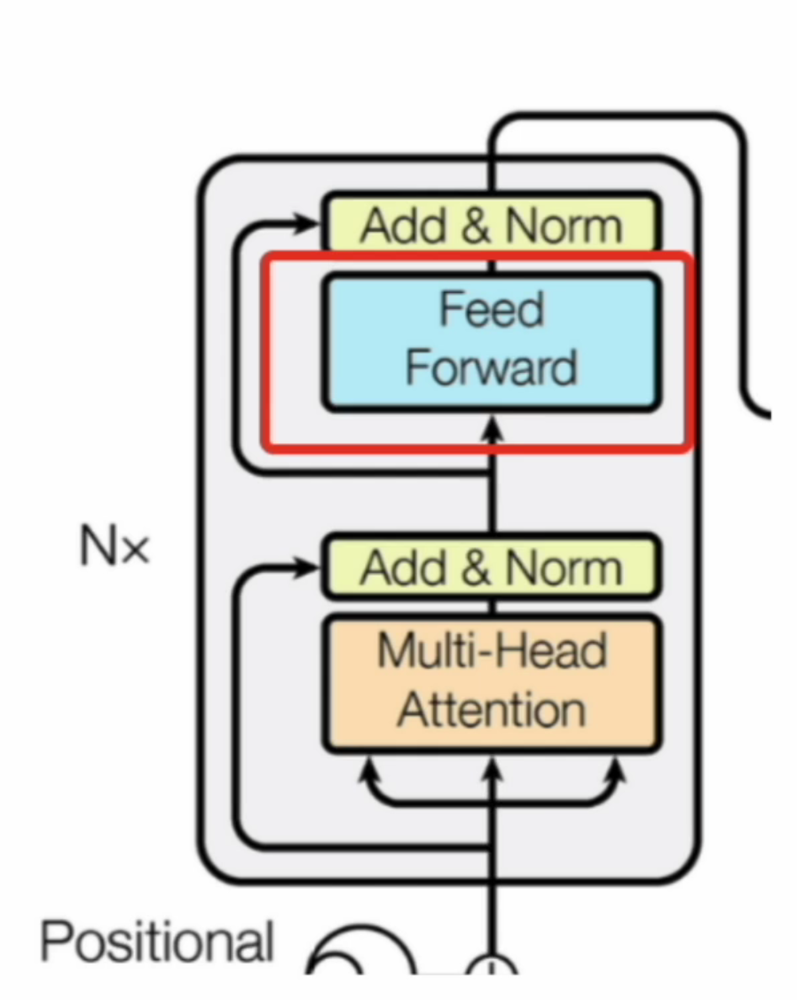

# Transformer Architecture Overview


### Key Concepts

##### 1. Input Embedding
Converts input tokens into continuous vectors that the model can process.

#### 2. Encoder
Consists of multiple layers, each containing a self-attention mechanism and a position-wise feed-forward network that process the input.

#### 3. Decoder
Also consists of multiple layers; each layer contains self-attention, encoder-decoder attention, and a feed-forward network to generate output.

#### 4. Self-Attention Mechanism
Allows the model to learn relationships between tokens in a sequence, even if they are far apart.

#### 5. Positional Encoding
Added to input embeddings to provide information about token order.

#### 6. Layer Normalization
Used to stabilize training by normalizing activations within each layer.

#### 7. Residual Connections
Help gradients flow across deep networks, mitigating vanishing gradient issues.

#### 8. Encoder-Decoder Attention
Used in the decoder to focus on relevant encoder outputs when generating each token.

#### 9. Output Linear Layer
Converts decoder outputs into logits over the target vocabulary.

#### 10. Softmax Layer
Applies softmax to logits to produce token probabilities.

---

## Encoder–Decoder Example



The encoder processes the input text; the decoder generates the output.

#### Example (translation):
```
"Hello" -> Encoder -> representations -> Decoder -> "Hola"
```

---

## Attention Mechanism



Attention assigns different weights to tokens in the input sequence so the model can focus on the most relevant parts, improving its ability to understand long contexts.

### Types of Attention

#### Self-Attention
Enables the model to determine the importance of each token relative to others and understand token relationships.

#### Scaled Dot-Product Attention
Computes attention scores using dot products between queries and keys, scales them, and applies softmax.

#### Multi-Head Attention
Uses multiple attention "heads" to capture different aspects of relationships (syntactic, semantic, etc.) in parallel.

---

### Positional Encoding: Preserving Order


---

### Feed-Forward Networks: Refining Token Representations


Position-wise feed-forward networks (FFNs) are applied to each position independently and help the model learn complex, non-linear relationships between embeddings and their context.

---

### Layer Normalization: Stabilizing Training
Layer normalization helps stabilize training by scaling and centering layer inputs, leading to improved training stability and faster convergence.


